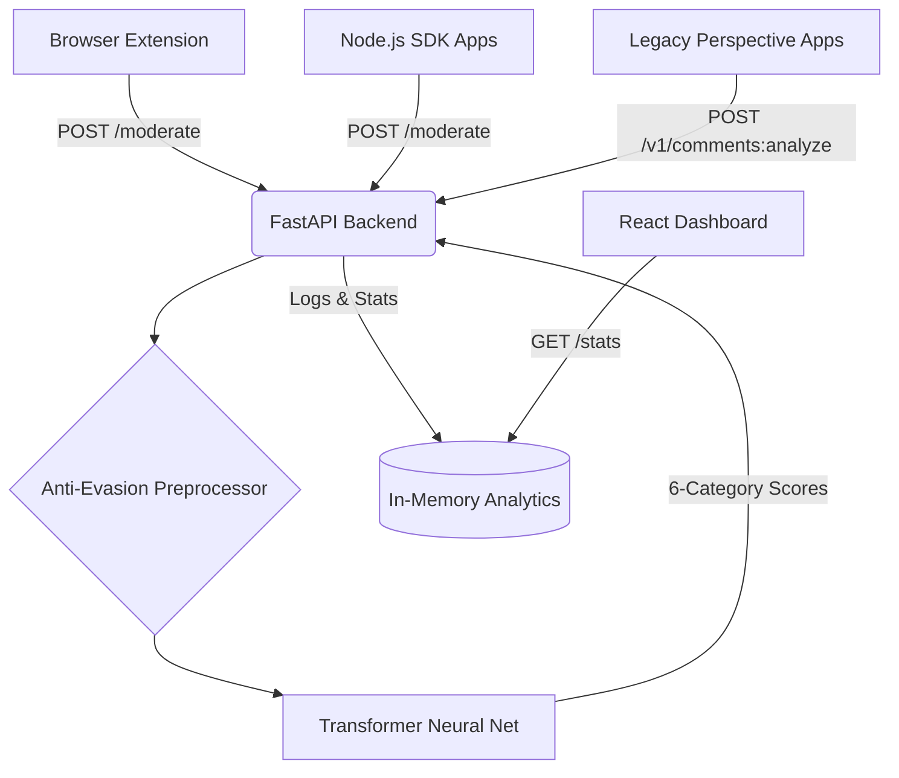

<p align="center">
  
</p>

<h1 align="center">🛡️ CommentGuard</h1>

<p align="center">
  <strong>Open-source, self-hostable toxic comment moderation API + Chrome extension.</strong><br>
  Multi-label toxicity detection with anti-evasion. Drop-in Perspective API replacement.<br>
  No paid SaaS, no data leaving your servers.
</p>

<p align="center">
  <a href="LICENSE"></a>
  
  
  
  
</p>

---

## 📑 Table of Contents
- [Features](#-features)
- [Quick Start](#-quick-start)
- [Developer SDK & Integrations](#-developer-sdk--integrations)
- [Live Dashboard](#-live-dashboard)
- [Chrome Extension](#-chrome-extension)
- [Perspective API Migration](#-perspective-api-migration)
- [API Reference](#-api-reference)

---

## ✨ Features

- 🏷️ **Multi-label classification** — 6 toxicity categories: `toxic`, `severe_toxic`, `obscene`, `threat`, `insult`, `identity_hate`
- ⚡ **FastAPI backend** — `POST /moderate` classifies text in < 50ms (classical) or ~150ms (transformer)
- 🛡️ **Anti-evasion** — defeats leetspeak (`h4t3`), Unicode tricks, zero-width chars, separator evasion (`k.i.l.l`)
- 🔄 **Perspective API compatible** — drop-in replacement endpoint (`POST /v1/comments:analyze`)
- 📦 **Batch API** — moderate up to 100 texts in a single request
- 🧠 **Swappable models** — TF-IDF + Logistic Regression *or* `unitary/toxic-bert` via `MODEL_TYPE` env var
- 📈 **Live Dashboard** — beautiful React/Vite analytics dashboard to visualize the moderation stream
- 🧩 **Chrome extension** — live-filters 9 sites: YouTube, Reddit, HN, Twitter/X, Discord, Twitch, Facebook, Instagram
- 📊 **Live analytics** — `/stats` endpoint with per-category toxicity breakdown
- 🔁 **Feedback loop** — users can report false positives; data is logged for retraining
- 🔌 **Drop-in integration** — Node.js, Django, Laravel, Next.js examples included
- 🐳 **Docker-ready** — `docker compose up` and you're live
- 🔒 **Privacy-first** — runs 100% on your own infrastructure

---

## 🏗️ Architecture



---

## 🚀 Quick Start

### Option A — 1-Click Local Start (Easiest)
We wrote a startup script that automatically boots up both the AI Backend and the React Dashboard for you.

```bash
# Clone the repository
git clone https://github.com/init-krish/commentguard
cd commentguard

# On Mac/Linux:
./start.sh

# On Windows:
start.bat
```
Both the API (`localhost:8000`) and the Dashboard (`localhost:3000`) will instantly go live.
  -d '{"text": "I hate you so much"}'
```

### Option B — Docker

```bash
cd commentguard/backend
cp .env.example .env
docker compose up -d

```bash
curl http://localhost:8000/health
```

---

## 📈 Live Dashboard

CommentGuard comes with a beautiful, real-time React dashboard to monitor toxicity rates and view live moderation logs.

```bash
cd dashboard
npm install
npm run dev
```
Navigate to `http://localhost:3000` to see your AI in action.

---

## 🔌 Developer SDK & Integrations

Integrating CommentGuard into your application is incredibly simple. We offer an official Node.js SDK:

```bash
npm install @commentguard/sdk
```

For full copy-paste examples in **Node.js, Vanilla JS, Python, and PHP**, see our [Integration Guide](docs/INTEGRATIONS.md).

---

## 🔄 Perspective API Migration

Google's Perspective API is shutting down on Dec 31, 2026. CommentGuard acts as a 1:1 drop-in replacement.
See our [Perspective Migration Guide](docs/PERSPECTIVE_MIGRATION.md) for instructions on how to switch by changing just one line of code.

---

## 🧠 Model Training (Classical)

CommentGuard runs with the Deep Learning Transformer by default. If you want to use the ultra-fast classical model (`TF-IDF + Logistic Regression`), you need to train it first.

### Step-by-Step Training Guide
1. **Download Dataset:** Get the [Jigsaw Toxic Comment Dataset](https://www.kaggle.com/c/jigsaw-toxic-comment-classification-challenge) from Kaggle.
2. **Train:** Run `python model/train.py` on your local machine or in a Kaggle Notebook.
3. **Move Files:** The script will output three files. You **must** move them into the backend directory:
   - Move `vectorizer.joblib` ➡️ `backend/app/ml/vectorizer.joblib`
   - Move `models.joblib` ➡️ `backend/app/ml/models.joblib`
   - Move `model_meta.json` ➡️ `backend/app/ml/model_meta.json`
4. **Configure:** Open your `backend/.env` file and set `MODEL_TYPE=classical`.
5. **Restart:** Restart the backend or Docker container.

### Evaluation Metrics (Classical)

| Metric | Score |
|--------|-------|
| **ROC-AUC** | ~0.97 |
| **Precision (toxic)** | ~0.82 |
| **Recall (toxic)** | ~0.76 |
| **F1 (toxic)** | ~0.79 |

> For full model documentation, see [`model/MODEL_CARD.md`](model/MODEL_CARD.md)

---

## 🔌 API Reference

| Method | Endpoint | Description |
|--------|----------|-------------|
| `POST` | `/moderate` | Multi-label moderation — returns scores for 6 toxicity categories |
| `POST` | `/moderate/batch` | Batch moderation — up to 100 texts in one request |
| `POST` | `/v1/comments:analyze` | **Perspective API compatible** — drop-in replacement |
| `POST` | `/predict` | Alias for `/moderate` (Chrome extension backwards compat) |
| `GET` | `/health` | Health check — model type, version, features, categories |
| `GET` | `/stats` | Live analytics — per-category breakdown, recent log |
| `POST` | `/feedback` | Submit false positive/negative reports for retraining |
| `GET` | `/docs` | Interactive Swagger UI (auto-generated by FastAPI) |

### Example Request & Response

```bash
curl -X POST http://localhost:8000/moderate \
  -H "Content-Type: application/json" \
  -d '{"text": "You are terrible", "threshold": 0.5}'
```

```json
{
  "label": "toxic",
  "toxic_prob": 0.87,
  "decision": "block",
  "categories": ["toxic", "insult"],
  "scores": {
    "toxic": 0.87,
    "severe_toxic": 0.12,
    "obscene": 0.34,
    "threat": 0.08,
    "insult": 0.82,
    "identity_hate": 0.05
  },
  "flagged": true
}
```

**Decision logic:**
- `block` — `toxic_prob >= threshold`
- `review` — `toxic_prob >= threshold × 0.6` (borderline)
- `allow` — below review threshold

---

## 🧩 Chrome Extension

<table>
<tr>
<td width="50%">

### Installation

1. Open `chrome://extensions/` (or `brave://extensions/`)
2. Enable **Developer Mode**
3. Click **Load unpacked** → select `extension/` folder
4. Navigate to any supported site
5. Toxic comments are blurred with category badges

### Supported Sites (9)

| Site | Status |
|------|--------|
| YouTube | ✅ |
| Reddit | ✅ |
| Hacker News | ✅ |
| Twitter / X | ✅ |
| Discord (web) | ✅ |
| Twitch | ✅ |
| Facebook | ✅ |
| Instagram | ✅ |
| Hacker News | Comment text blocks |

> Add more sites by extending `SITE_SELECTORS` in `content.js`

</td>
<td width="50%">

### Extension Features

- 🔴 **Toxic comments** → blurred with red badge + probability %
- 🟡 **Borderline comments** → softly blurred with amber badge
- 👆 **Click to reveal** — any blurred comment can be unblurred
- 📊 **Live session stats** — scanned, blurred, blocked counts in popup
- ⚙️ **Configurable** — threshold slider, custom API endpoint
- 🔁 **Auto-feedback** — revealing a comment sends a false-positive report

</td>
</tr>
</table>

---

## ⚙️ Configuration

Set via `.env` file or environment variables:

| Variable | Default | Options | Description |
|----------|---------|---------|-------------|
| `MODEL_TYPE` | `classical` | `classical`, `transformer` | Model backend to use |
| `THRESHOLD` | `0.5` | `0.0 – 1.0` | Default block threshold |
| `ENV` | `development` | `development`, `production` | Environment label |

---

## 🔗 Integrate Into Your Website

See [`docs/INTEGRATIONS.md`](docs/INTEGRATIONS.md) for copy-paste examples in:

- **Node.js / Express**
- **Python / Django**
- **PHP / Laravel**
- **Next.js (API routes)**

**Pattern:** Call `POST /moderate` before saving any user comment to your database. Use the `decision` field to `allow`, `review`, or `block`.

---

## 🧪 Testing

```bash
cd backend
pip install -r requirements.txt   # includes pytest
pytest tests/ -v
```

The test suite covers:
- Health check endpoint
- Toxic & clean comment classification
- Empty/missing text validation (422)
- Custom threshold overrides
- Feedback recording
- Edge cases (Unicode, long text, special characters)

---

## 📋 Roadmap

- [ ] Multi-label classification (insult / threat / hate / obscene)
- [ ] Hindi + Hinglish support
- [ ] Dashboard web UI for analytics
- [ ] Persistent feedback logging (SQLite)
- [ ] Firefox extension
- [ ] npm package: `commentguard-client`
- [ ] Rate limiting middleware
- [ ] Batch moderation endpoint (`POST /moderate/batch`)

---

## 🤝 Contributing

Contributions are welcome! See [`CONTRIBUTING.md`](CONTRIBUTING.md) for guidelines.

---

## 📄 License

Licensed under the **Apache License 2.0** — see [`LICENSE`](LICENSE) for details.

Free to use, modify, and deploy commercially with attribution.
